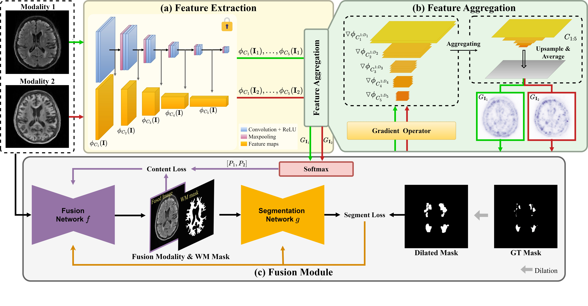

# DeAFusion: Detail-Aware Image Fusion for Whitematter Hyperintensity Segmentation

This is official Pytorch implementation of **DeAFusion: Detail-Aware Image Fusion for Whitematter Hyperintensity Segmentation**.

## Framework


Our code was written by applying BiSeNet and the Fusion model from U2Fusion's DenseNet. We would like to thank those who have shared their code. Thanks to everyone who contributed code and models.

- [BiSeNet: Bilateral Segmentation Network for Real-time Semantic Segmentation](https://github.com/CoinCheung/BiSeNet) 
- [U2Fusion](https://github.com/ytZhang99/U2Fusion-pytorch)


## Recommended Environment
- [ ] torch==2.1.0
- [ ] torchvision==0.16.0
- [ ] numpy==1.26.0
- [ ] gudhi==3.10.1
- [ ] albumentations==1.4.14

## Dataset
The training data and testing data is from the [WMH Segmentation Challenge 2017](https://wmh.isi.uu.nl).


## Training and Inference

1. Download the pre-trained densenet model from [U2Fusion](https://github.com/ytZhang99/U2Fusion-pytorch/tree/master/model/model.pth) and rename it to `densenet.pth`. Place it in the same directory with `model.py`.

2. Place the T1, FLAIR, WM mask, and WMH Ground Truth images in the directories specified by `dataset.train.root`, `dataset.val.root`, and `dataset.test.root` in the configuration file under respective `src1`, `src2`, `label`, and `mask` images.

3. Set the phase to `train`, in the configuration file, then run the following code:
```
python train.py -p ./configs/wmh_fusion.yaml
```
4. To test, set the phase to `val` in the configuration file, then run the follwoing code:
```
python run_fusion.py -p ./configs/wmh_fusion.yaml
```


This can then be visualized with TensorBoard, which should be installable and runnable with:
```
tensorboard --logdir=wmh_fusion
```

## Fusion Example


## Segmentation Example

<!-- 
## Citation
The following paper might be cited:
```
@article{xu2020u2fusion,
  title={U2Fusion: A unified unsupervised image fusion network},
  author={Xu, Han and Ma, Jiayi and Jiang, Junjun and Guo, Xiaojie and Ling, Haibin},
  journal={IEEE Transactions on Pattern Analysis and Machine Intelligence},
  year={2020},
  publisher={IEEE}
}
``` -->
